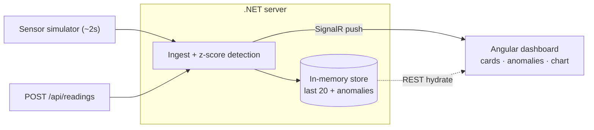
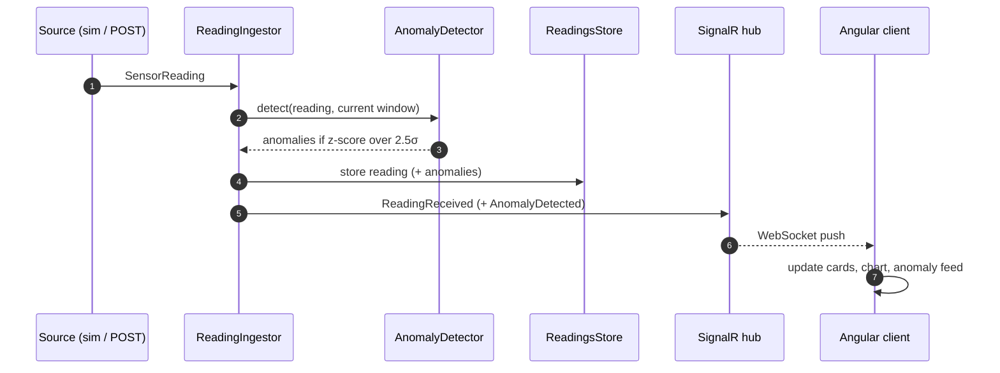

# Greenhouse Guard — IoT Monitoring Showcase

A compact full-stack demo of an **IoT telemetry monitoring** pipeline for a mock
greenhouse. It showcases the core patterns of a real-time IoT dashboard:

- **Device telemetry ingestion** — sensor readings arrive via a streaming
  simulator and a bulk REST endpoint (the same path a real gateway would use).
- **Real-time fan-out** — new readings and alerts are pushed to every connected
  client over **SignalR** (WebSockets).
- **Edge-style anomaly detection** — a rolling-window **z-score** check flags
  out-of-range temperature, humidity, and CO₂ values on the fly.
- **Live operations dashboard** — sensor cards with status colors, an anomaly
  feed, a trend chart, and a connection/heartbeat indicator.

**Stack:** .NET 10 (ASP.NET Core, SignalR, in-memory) · Angular 21 (standalone +
signals, zoneless, RxJS) · Angular Material + Tailwind · Chart.js

## Architecture notes

**Components & data flow** — both telemetry sources feed one pipeline, which
fans out over REST (pull) and SignalR (push):



**Runtime loop** — what happens on every reading:



- **One pipeline, two sources.** The `SensorSimulator` and `POST /api/readings`
  both call `ReadingIngestor`, so simulated and "real" telemetry behave
  identically (assign metadata → detect → store → broadcast).
- **Detect against history, then store.** Detection runs over the *current*
  window before the new reading is added, so a value is scored against prior
  history rather than itself.
- **In-memory window.** `ReadingsStore` keeps the last 20 readings (detection +
  chart window) and recent anomalies — no database.
- **Two transports.** REST for request/response + initial hydrate; SignalR for
  live `ReadingReceived` / `AnomalyDetected` push and a client `Heartbeat`. The
  Angular dev server proxies `/api` and `/hubs` to the backend.
- **LIVE/OFFLINE** combines the browser online state with the hub heartbeat.

## Prerequisites

- **.NET SDK 10**
- **Node.js** 22.12+

## Setup

```bash
npm install          # installs client deps + restores server (postinstall)
```

## Run

Both apps together (client on **:4200**, server on **:5255**):

```bash
npm start
```

Then open **http://localhost:4200**. The Angular dev server proxies `/api` and
`/hubs` to the backend, so no extra config is needed.

### Backend only

```bash
npm run server          # dotnet run --project server --launch-profile http
```

- REST API: `GET /api/readings/latest`, `POST /api/readings`, `GET /api/anomalies`
- SignalR hub: `/hubs/sensors`
- Swagger (Development): http://localhost:5255/swagger

### Frontend only

```bash
npm run client          # ng serve (requires the backend running for live data)
```

## Tests

```bash
npm test                # server (xUnit) + client (Vitest)
```

Focused on the critical logic: z-score anomaly detection, the rolling-window
store, and the client state service (window/anomaly caps).

## Assumptions

- **Single, simulated sensor source** — a hosted `BackgroundService` generates a
  reading every ~2s (with periodic spikes); no real hardware.
- **In-memory only** — readings (last 20) and anomalies are not persisted; state
  resets on restart. No database, no auth (per the brief).
- **Local dev setup** — HTTP profile, CORS limited to `localhost:4200`, Swagger
  enabled only in Development.

## Extra features roadmap

- **Authentication & authorization** — secure the REST API and SignalR hub
  (e.g. JWT), with per-user roles for viewing vs. managing facilities.
- **Multiple greenhouse facilities** — model many sites/devices, scope readings
  and anomalies per facility, fan out via per-facility SignalR groups, and add a
  facility switcher to the dashboard.
- **Offline queue** (localStorage + retry on reconnect)
- **Persistence** — swap the in-memory store for a database
- **More test coverage** — integration/E2E tests beyond the few unit tests.

